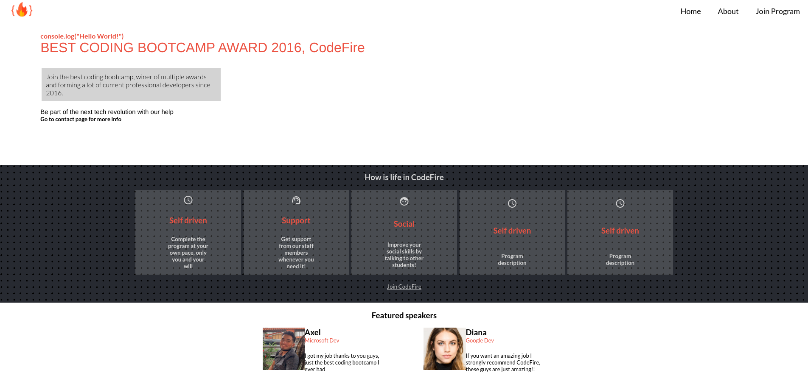

# CodeFire WebPage 

> This project is a website consiting of only two pages, home and about, it works with CSS, HTML and JS. Project for Microverse Capstone 1

Currently it is only a really simple website for the Microverse Capstone 1, however, it will be upgraded in the future with more content.

## Built With

- HTML
- CSS
- JS

## Live Demo

[Live Demo Link](https://katiscoding.github.io/Capstone-1/)

## Demo Video

[Demo Video](https://www.loom.com/share/2d40894ed3e04ef4b62436c5084f813a)

## Getting Started

**This is an example of how you may give instructions on setting up your project locally.**

To get a local copy up and running follow these simple example steps.

### Prerequisites
- A web browser

### Setup
Clone this repository with

git clone https://github.com/KatIsCoding/Capstone-1/tree/homeandaboutpages

### Usage
Open the index.html file with your browser

### Run tests
Install linters dependencies with this:
- npm install --save-dev hint@6.x
- npm install --save-dev stylelint@13.x stylelint-scss@3.x stylelint-config-standard@21.x stylelint-csstree-validator@1.x
- npm install --save-dev eslint@7.x eslint-config-airbnb-base@14.x eslint-plugin-import@2.x babel-eslint@10.x

After that you can execute the following commands to test all the files:
> This will test the .html files
- npx hint .

> This will test the .css files
- npx stylelint "**/*.{css,scss}"

> This will test all the .js files
- npx eslint .

### Deployment
- Clone this repository in a new repository
- Go to github pages of that new repository
- Select the main branch and click on save

## Authors

👤 **Fabrizio Gomez**

- GitHub: [@KatIsCoding](https://github.com/KatIsCoding)
- Twitter: [@fabriziogr211](https://twitter.com/fabriziogr211)
- LinkedIn: [Fabrizio Gomez](https://www.linkedin.com/in/fabrizio-gomez-6a00801a3/)

## 🤝 Contributing

Contributions, issues, and feature requests are welcome!

## Show your support

Give a ⭐️ if you like this project!

## Acknowledgments

- The Creative Commons License by Cindy Shin [template](https://www.behance.net/gallery/29845175/CC-Global-Summit-2015) was used for this project 
- Google Icons were used in the creation of this project.
- This is a project for Microverse Coding Bootcamp

## 📝 License

This project is [MIT](./MIT.md) licensed.
